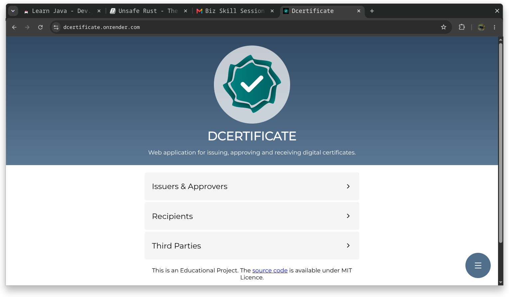
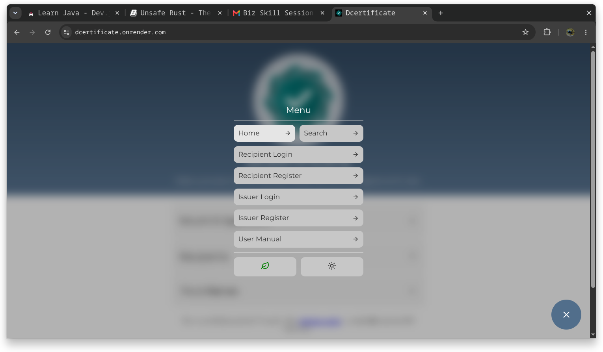
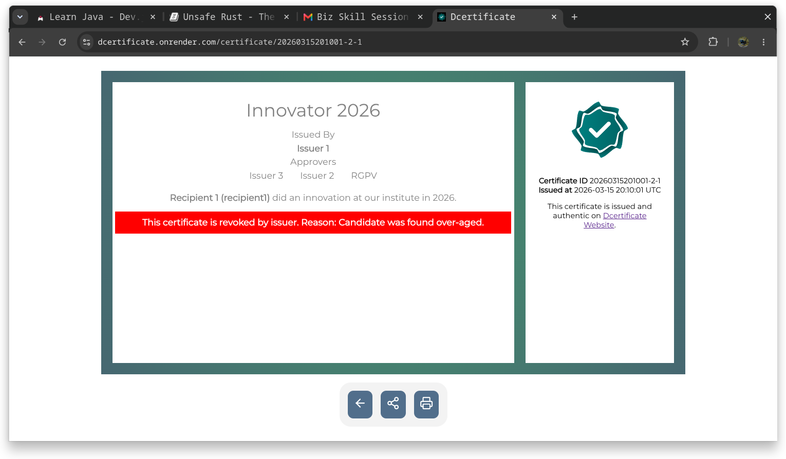

# DCERTIFICATE

D-Certificate (Digital Certificate)
is a simple web application
for issuing, approving & receiving digital certificates.

This is an educational project
but, it won't make a difference
if you decide
to use it for real purposes.

